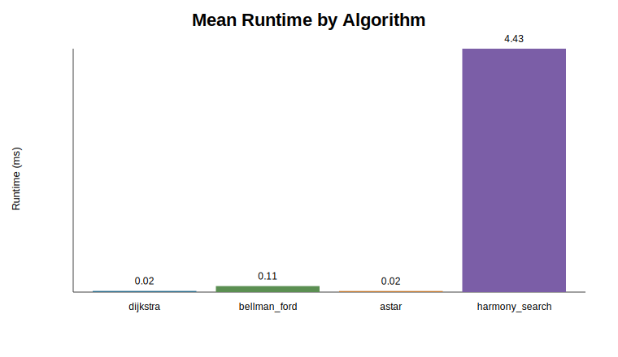
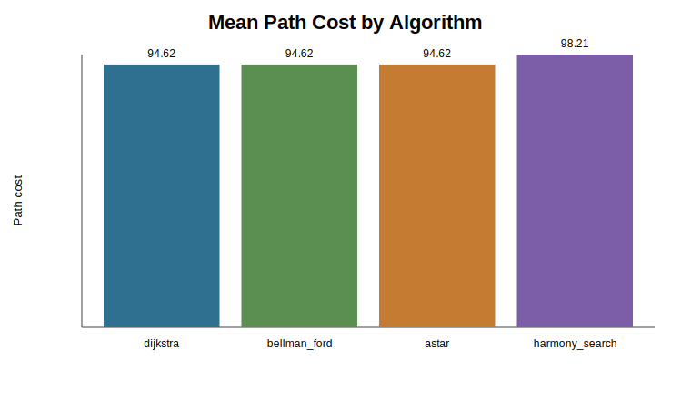
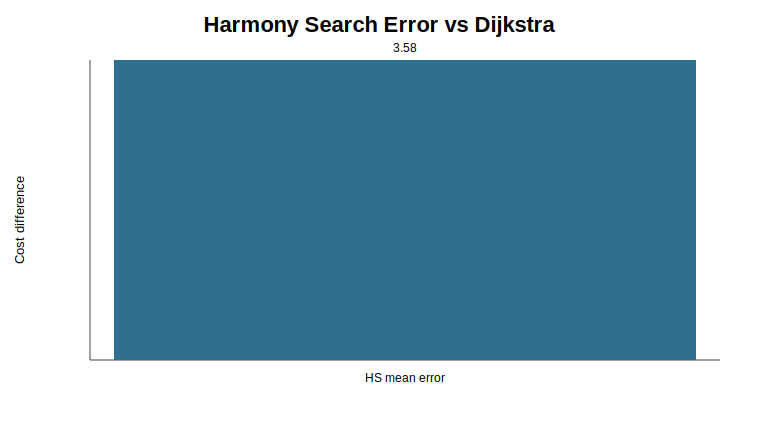

# Experiment Results Summary

Source CSV: `..\raw\small_experiment.csv`

## Visuals

## Algorithm Averages

| Algorithm | Mean runtime (ms) | Mean path cost | Success rate |
| --- | ---: | ---: | ---: |
| dijkstra | 0.020 | 94.625 | 100.0% |
| bellman_ford | 0.109 | 94.625 | 100.0% |
| astar | 0.020 | 94.625 | 100.0% |
| harmony_search | 4.429 | 98.208 | 100.0% |

## Interpretation

- The data includes 72 runs across 8 graph instance(s).
- `astar` had the fastest average runtime in this run.
- `dijkstra` had the lowest average path cost.
- Harmony Search averaged 3.583 cost units above Dijkstra on matching graph instances.
- Dijkstra is the exact benchmark, so it anchors the path-quality comparison.
- Bellman-Ford is expected to be slower because it checks the graph more broadly.
- A* uses a zero heuristic for random weighted graphs, so it should behave similarly to Dijkstra in this experiment.
- Harmony Search is approximate; the important question is whether its path cost is close enough to Dijkstra to justify its runtime.
